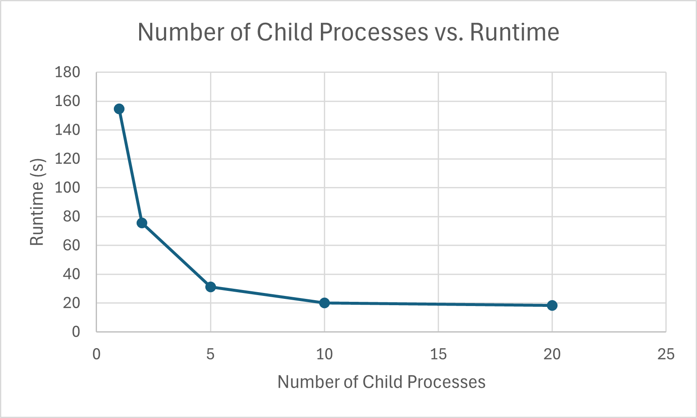
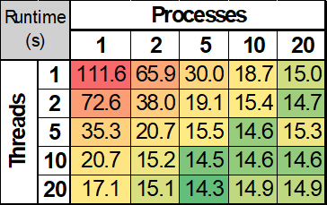

# System Programming Lab 11 Multiprocessing
## Anthony Higareda
### 19 November 2025

#### [Repository Link Here](https://github.com/MSOE-CPE2600/multiprocessing-turney-anthonyHigareda)

## Implementation
For this lab, I experimented with various different values for the X and Y centers and Scale parameters until I found a final frame that I liked. I recorded those parameters and created `const double` variables for each of those parameters. Then I created 3 arrays to hold 50 doubles for each set of parameters for each frame. I set the values at index 0 to the starting parameters, then used logic to gradually move into the final values. By finding the distance between the goal and the previous step and dividing that by 2 for the X and Y centers and 1.8 for the scale, I was able to approach the "ideal" frame and slow down the adjustment as the scene approached it. 
To handle the logic for the child processes, I initialized an integer variable `num_active_processes` to 0, then entered a `for` loop that would execute once for every frame. At the beginning of the loop, if there were the same or more active processes than had been specified by the `-p` argument from the command line, then the process that reached it would wait until it's child would finish, then decrement the number of active processes. Next, a `fork()` would be executed. The child process from that fork would create the frame for the current iteration. The parent process would increment the number of active processes, and head into the next loop. After all 50 frames have begun their creation, the parent processes would exit the loop and enter a while loop. This loop waits for all remaining children to finish. After all children have finished, the buffer for the output filename is freed, and the program exits.

## Runtime graph for differring number of child processes

## Discussion
The results show that, by adding more child processes, you can greatly reduce the runtime of a program. By multiplying the number of processes by 2, the runtime can be cut by almost half. As the number of processes increase, however, the amount of gains does reach a limit. This can be dictated by the hardware. For instance, on a device with a 12-core CPU, the maximum amount of processes that can be executed at once, is 12. More processes can be created, but they will need to be switched in and out from the active threads and this will not significantly reduce the runtime. 

# System Programming Lab 12 Multithreading
## Anthony Higareda
### 25 November 2025

## Implementation
For this lab, I maintained all multiprocessing functionality from Week 11. To get started, I added an additional command line argument option `-t` to control the number of threads that would be used to create each image, defaulting to 1 dedicated thread.  
I moved the existing code inside of `compute_image()` into the `else` branch of a new `if-else` block. The `if` branch would enter if the number of threads specified was non-zero, that number being passed in as a new integer parameter, `threads`. Inside of the `if` block, I maintained the `width` and `height` variables logic from the previous version. Next, I allocated space for 2 arrays. The first would store `pthreads` and the next would store `thread_slice` structures, both holding an amount of each equal to the number of threads specified.  
After allocating memory for the arrays, a `for` loop is entered and will execute once for each thread being created. Inside of this loop, a `thread_slice` structure at the appropriate index within the array is define to have the following data:
- `imgRawImage* img`
- `double xmin`
- `double xmax`
- `double ymin`
- `double ymax`
- `int max`
- `int width`
- `int height`
- `int height_start` : The y-value that this thread would begin drawing at. Defined inside of `compute_image()` as the total height of the image divided by the number of threads being used to create this image, multiplied by the index of this `thread_slice` in the array.
- `int height_end` : The y-value that this thread would stop drawing at. Defined inside of `compute_image()` as the `height_start` plus the quantity total image height divided by the number of threads.
> Unless otherwise specified, all data fields in a `thread_slice` will be equivalent to the parameters passed in to `compute_image()` 

Once the `thread_slice` has had all data fields set, `pthread_create()` is called, creating a thread using the `pthread_t` at the appropriate index within the array, and linking the function `create_img_slice()` that takes in the `thread_slice` just defined as a parameter.  
The function `create_img_slice` uses logic identical to the original logic within `compute_image()` except for the bounds of the `for` loop that controls the y-value that pixels will be drawn at. The starting value is equal to the `height_start` field, and the ending value is equal to the `height_end` field of the `thread_slice` parameter.  
Once all threads have been created inside of `compute_image()`, the first `for` loop exits, and a second loop enters. This loop runs once for each thread, and calls `pthread_join()` for each thread that was created. Once all threads have been joined and this loop exits, the allocated memory for the arrays of `pthreads` and `thread_slices` are freed.

## Table of Runtimes for Different Amounts of Threads and Processes

## Discussion
It appears that multiprocessing had a larger effect on the runtime of this program. At 1 process and 20 threads, the runtime was approximately 17 seconds, but with 20 processes and only 1 thread, the runtime was 15 seconds. I think this can largely be attributed to the amount of setup computations and copying of data that are required to be able to start one thread, while running multiple processes allows multiple images to be started almost as soon as the processes has been spawned.  
There is a sweet spot where minimal runtime was achieved. With 5 processes and 20 threads, the runtime was as low as 14.3 seconds. I'm not sure why this exact combination of threads and processes had the minimum, but I think it might be attributed to having multiple spare CPU cores on the machine to handle other processes outside of this program so the 5 cores that were dedicated to computations were able to switch out their active threads just slightly quicker than if they had to also switch in other unrelated processes inbetween a Mandelbrot calculation. 